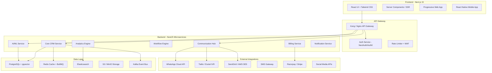
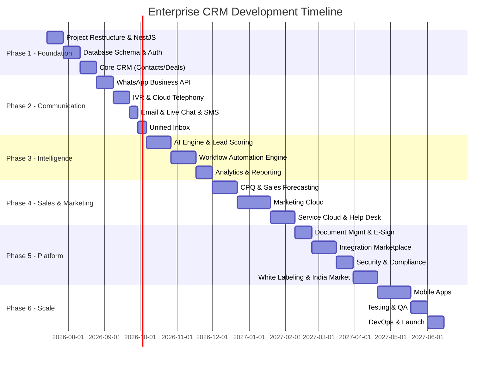

# 🚀 Enterprise CRM Pro — Complete Implementation Plan

**Goal:** Salesforce, HubSpot, Zoho se better & advanced enterprise-grade CRM banana hai — WhatsApp, IVR, AI Agents, aur 2026 ke latest features ke saath.

**Date:** July 2026  
**Status:** 📋 Planning Phase

---

## 🏗️ Architecture Overview



---

## 🛠️ Tech Stack (2026 Enterprise Standard)

| Layer | Technology | Why |
|-------|-----------|-----|
| **Frontend** | Next.js 15 + React 19 + TypeScript | SSR, RSC, best performance |
| **Styling** | Tailwind CSS + Radix UI + Framer Motion | Premium UI, accessible, animated |
| **State** | Zustand + TanStack Query v5 | Lightweight, server-state caching |
| **Backend** | NestJS + TypeScript | Modular, enterprise-grade, scalable |
| **Database** | PostgreSQL 17 + Prisma ORM | Reliable, RLS for multi-tenancy |
| **AI/Vector** | PostgreSQL pgvector + OpenAI/Gemini API | RAG, embeddings, AI features |
| **Cache** | Redis 7 + BullMQ | Caching, job queues, rate limiting |
| **Search** | Elasticsearch / Meilisearch | Full-text search, analytics |
| **File Storage** | AWS S3 / MinIO | Documents, attachments, media |
| **Events** | Kafka / Redis Streams | Event-driven architecture |
| **Auth** | NextAuth v5 / Auth0 | SSO, MFA, SAML, OAuth2 |
| **Email** | SendGrid / AWS SES | Transactional + marketing emails |
| **WhatsApp** | WhatsApp Cloud API (Meta) | Business messaging |
| **Voice/IVR** | Twilio / Exotel / Ozonetel | Cloud telephony, IVR |
| **SMS** | Twilio / MSG91 | OTP, notifications, campaigns |
| **Video** | Twilio Video / Daily.co | Video calls, screen sharing |
| **Payments** | Razorpay / Stripe | Subscriptions, invoicing |
| **Monitoring** | Prometheus + Grafana + Sentry | APM, error tracking, alerts |
| **CI/CD** | GitHub Actions + Docker + K8s | Automated pipelines |
| **CDN** | Cloudflare / AWS CloudFront | Global performance |

---

## 📦 Complete Module List (20+ Modules)

Ye sab modules hain jo Salesforce + HubSpot + Zoho se **zyada** features denge:

### Module Map vs Competition

| Module | Salesforce | HubSpot | Zoho | **Our CRM** |
|--------|-----------|---------|------|-------------|
| Contact Management | ✅ | ✅ | ✅ | ✅ + AI Enrichment |
| Deal Pipeline | ✅ | ✅ | ✅ | ✅ + AI Prediction |
| WhatsApp Integration | ❌ (3rd party) | ❌ (3rd party) | ❌ (basic) | ✅ **Native** |
| IVR/Cloud Telephony | ❌ (addon) | ❌ (addon) | ❌ (addon) | ✅ **Built-in** |
| AI Agentic Automation | ✅ (Agentforce $$$) | ✅ (Breeze) | ✅ (Zia) | ✅ **Included** |
| Visual Workflow Builder | ✅ | ✅ | ✅ | ✅ + AI Suggestions |
| CPQ (Configure Price Quote) | ✅ ($$$) | ❌ | ❌ | ✅ **Included** |
| Built-in Video Calls | ❌ | ❌ | ❌ (Cliq) | ✅ **Native** |
| Document Management | ❌ (addon) | ✅ (basic) | ✅ | ✅ + E-Sign |
| Field Service | ✅ ($$$) | ❌ | ❌ | ✅ **Included** |
| Developer Platform | ✅ | ✅ | ✅ | ✅ + SDK + Marketplace |
| White Labeling | ❌ | ❌ | ❌ | ✅ **Full** |
| Indian Market Focus | ❌ | ❌ | ✅ | ✅ **GST, UPI, Aadhaar** |

---

## 📋 Phase-Wise Implementation Plan

---

### 🔵 PHASE 1: Foundation & Core (Weeks 1-6)

> [!IMPORTANT]
> Ye sabse critical phase hai — agar foundation strong nahi hogi toh baaki sab fail hoga.

#### 1.1 Project Restructure & Tech Migration

##### [DELETE] Current mock server approach
- Remove `index-simple.ts` god file
- Remove all `*-simple.tsx` duplicate files
- Clean up redundant documentation files

##### [NEW] NestJS Backend Setup
```
server/
├── src/
│   ├── app.module.ts
│   ├── main.ts
│   ├── common/                    # Shared utilities
│   │   ├── decorators/            # Custom decorators
│   │   ├── filters/               # Exception filters
│   │   ├── guards/                # Auth, Role, Tenant guards
│   │   ├── interceptors/          # Logging, Transform
│   │   ├── pipes/                 # Validation pipes
│   │   └── middleware/            # Tenant, CORS, Rate limit
│   ├── config/                    # Configuration module
│   ├── database/                  # Prisma module + migrations
│   ├── modules/
│   │   ├── auth/                  # Authentication module
│   │   ├── users/                 # User management
│   │   ├── tenants/               # Multi-tenant management
│   │   ├── contacts/              # Contact management
│   │   ├── companies/             # Company management
│   │   ├── deals/                 # Deal pipeline
│   │   ├── activities/            # Activity tracking
│   │   ├── tasks/                 # Task management
│   │   └── notifications/         # Real-time notifications
│   └── shared/                    # Shared DTOs, interfaces
```

##### [NEW] Next.js Frontend Migration
```
client/
├── src/
│   ├── app/                       # App Router (Next.js 15)
│   │   ├── (auth)/                # Auth layout group
│   │   │   ├── login/
│   │   │   └── register/
│   │   ├── (dashboard)/           # Dashboard layout group
│   │   │   ├── layout.tsx         # Sidebar + Header
│   │   │   ├── dashboard/
│   │   │   ├── contacts/
│   │   │   ├── deals/
│   │   │   ├── companies/
│   │   │   └── tasks/
│   │   ├── (admin)/               # Admin layout group
│   │   │   ├── super-admin/
│   │   │   └── tenant-admin/
│   │   └── (marketing)/           # Public pages
│   │       ├── page.tsx           # Landing
│   │       ├── pricing/
│   │       └── features/
│   ├── components/
│   │   ├── ui/                    # Base UI components (Button, Input, Modal, etc.)
│   │   ├── forms/                 # Form components
│   │   ├── data-display/          # Tables, Charts, Cards
│   │   ├── layout/                # Sidebar, Header, Footer
│   │   └── features/              # Feature-specific components
│   ├── hooks/                     # Custom hooks
│   ├── lib/                       # Utilities, API client
│   ├── stores/                    # Zustand stores
│   └── types/                     # TypeScript types
```

#### 1.2 Database Schema (PostgreSQL + Prisma)

```
Key Tables:
├── tenants                        # Multi-tenant organizations
├── users                          # Users with RBAC
├── roles & permissions            # Granular permission system
├── contacts                       # Customer contacts
├── companies                      # B2B companies
├── deals                          # Sales pipeline deals
├── deal_stages                    # Custom pipeline stages
├── activities                     # Calls, emails, meetings, notes
├── tasks                          # Task management
├── tags                           # Flexible tagging system
├── custom_fields                  # Dynamic custom fields per tenant
├── custom_field_values            # Custom field data
├── audit_logs                     # Complete audit trail
├── notifications                  # In-app notifications
├── files                          # File/document metadata
└── settings                       # Tenant-level settings
```

**Multi-Tenancy Strategy:** PostgreSQL Row-Level Security (RLS) — har query mein automatic tenant filtering, data isolation guaranteed.

#### 1.3 Authentication & Authorization

| Feature | Implementation |
|---------|---------------|
| Email/Password Login | bcrypt + JWT (access + refresh tokens) |
| OAuth2 / Social Login | Google, Microsoft, GitHub via NextAuth |
| SSO (SAML / OIDC) | Enterprise SSO for large orgs |
| MFA / 2FA | TOTP (Google Authenticator) + SMS OTP |
| Role-Based Access (RBAC) | 6 roles: Super Admin → Tenant Admin → Manager → Sales Rep → Support Agent → Viewer |
| Attribute-Based Access (ABAC) | Field-level, record-level permissions |
| Session Management | Redis-backed sessions, device tracking |
| Password Policies | Complexity rules, expiry, history |
| IP Whitelisting | Tenant-level IP restrictions |
| Audit Logging | Every action logged with user, timestamp, IP |

#### 1.4 Core CRM Features

**Contact Management:**
- 360° Contact View — sab ek jagah (calls, emails, deals, WhatsApp chats, notes, files)
- AI-powered duplicate detection & merge
- Contact enrichment (auto-fetch LinkedIn, company data)
- Custom fields per tenant (text, number, date, dropdown, multi-select, formula)
- Smart Lists & dynamic segmentation
- Contact scoring (behavior + demographics)
- Bulk import/export (CSV, Excel, vCard)
- Contact timeline with all interactions

**Company Management:**
- Company hierarchy (parent-child relationships)
- Company-Contact associations
- Account health score
- Industry/Revenue/Employee data
- Company website scraping for auto-fill

**Deal Pipeline:**
- Multiple pipelines per tenant
- Drag-and-drop Kanban board
- Custom deal stages with probability %
- Deal value tracking (weighted pipeline)
- AI win/loss prediction
- Deal rot alerts (stale deals notification)
- Required fields per stage (e.g., must add proposal before "Negotiation")
- Deal collaboration — multiple team members
- Related contacts & companies
- Quote/Proposal generation

---

### 🟢 PHASE 2: Communication Hub (Weeks 7-12)

> [!IMPORTANT]
> Ye module hamein Salesforce se **alag** banayega — native omnichannel communication built-in, koi addon nahi.

#### 2.1 📱 WhatsApp Business API Integration

```
Features:
├── WhatsApp Cloud API (Meta Official)
├── Template Messages (HSM)
│   ├── Marketing templates
│   ├── Utility templates (order updates, receipts)
│   └── Authentication templates (OTP)
├── Interactive Messages
│   ├── Buttons (Quick Reply, Call-to-Action)
│   ├── List Messages (up to 10 sections)
│   ├── Product Catalog Messages
│   └── Location sharing
├── Media Messages
│   ├── Images, Videos, Documents
│   ├── Audio messages
│   └── Stickers
├── WhatsApp Chatbot
│   ├── AI-powered auto-replies
│   ├── Menu-based navigation
│   ├── FAQ bot
│   ├── Lead qualification bot
│   └── Appointment booking bot
├── Broadcast Campaigns
│   ├── Segmented broadcasts
│   ├── Scheduled campaigns
│   ├── Analytics (delivered, read, replied)
│   └── Opt-in/Opt-out management
├── WhatsApp Commerce
│   ├── Product catalog sync
│   ├── Cart & order management
│   └── Payment links in chat
└── Team Inbox
    ├── Multi-agent chat assignment
    ├── Auto-routing rules
    ├── Canned responses
    ├── Internal notes on chats
    ├── Chat transfer between agents
    └── SLA timers on response time
```

#### 2.2 📞 IVR & Cloud Telephony

```
Features:
├── Cloud PBX
│   ├── Virtual phone numbers (India + International)
│   ├── Call forwarding & routing
│   ├── Call recording (with consent)
│   └── Voicemail
├── IVR Builder (Visual Drag & Drop)
│   ├── Multi-level IVR menus
│   ├── DTMF input handling
│   ├── Voice-to-Text (AI transcription)
│   ├── Dynamic IVR (data from CRM)
│   │   Example: "Press 1 for your order status"
│   │   → System auto-fetches order from CRM
│   └── Conditional routing (VIP customer → priority agent)
├── Click-to-Call
│   ├── One-click calling from CRM
│   ├── Browser-based softphone (WebRTC)
│   ├── Mobile app calling
│   └── Auto-dial campaigns
├── Predictive Dialer
│   ├── Auto-dial from lead lists
│   ├── Agent availability detection
│   ├── Skip busy/no-answer
│   └── Call outcome logging
├── AI Voice Agent
│   ├── AI-powered voice bot for initial qualification
│   ├── Natural language understanding
│   ├── Appointment scheduling by voice
│   └── Post-call AI summary
├── Call Analytics
│   ├── Call duration, wait time, hold time
│   ├── Agent performance metrics
│   ├── Call sentiment analysis
│   ├── Keyword spotting
│   └── Quality scoring
└── Missed Call Automation
    ├── Auto WhatsApp follow-up
    ├── Auto SMS with callback link
    ├── Lead creation in CRM
    └── Assignment to available agent
```

#### 2.3 📧 Email System

```
Features:
├── Email Sync (IMAP/SMTP + Gmail API + Outlook API)
├── Email Tracking (opens, clicks, replies)
├── Email Templates (HTML drag-and-drop builder)
├── Email Sequences (automated follow-up chains)
│   ├── Delay-based sequences
│   ├── Behavior triggers (opened → send next)
│   ├── A/B testing subject lines
│   └── Auto-stop on reply
├── Bulk Email Campaigns
│   ├── Audience segmentation
│   ├── Personalization (merge fields)
│   ├── Schedule & send
│   ├── Bounce handling
│   └── Unsubscribe management
├── Email Analytics Dashboard
└── AI Email Writer
    ├── Auto-generate reply suggestions
    ├── Tone adjustment (formal/casual)
    └── Summary of email threads
```

#### 2.4 💬 Live Chat & SMS

```
Live Chat:
├── Website chat widget (customizable)
├── Chatbot + human handoff
├── Proactive chat triggers
├── Visitor tracking (page, time on site)
├── File sharing in chat
├── Chat ratings & feedback
└── Chat → Ticket conversion

SMS:
├── SMS campaigns (bulk + personalized)
├── SMS templates
├── OTP verification
├── Two-way SMS conversations
├── DND compliance (India TRAI)
└── Short URL tracking in SMS
```

#### 2.5 🎥 Video Calling

```
Features:
├── Browser-based video calls (WebRTC)
├── Screen sharing
├── Meeting scheduling (Google/Outlook calendar sync)
├── Meeting recording
├── AI meeting notes & action items
├── Meeting links (like Zoom/Google Meet)
├── Virtual background
└── In-CRM meeting — contact profile visible during call
```

#### 2.6 Unified Inbox

```
ALL channels in ONE inbox:
├── 📱 WhatsApp messages
├── 📧 Emails
├── 💬 Live chat
├── 📞 Call logs & voicemails
├── 📝 SMS messages
├── 🐦 Social media DMs (Instagram, Facebook, Twitter)
└── 🎥 Video call recordings

Features:
├── Contact auto-detection across channels
├── Conversation threading
├── Internal team notes
├── @mentions for team collaboration
├── Auto-assign rules
├── Priority/SLA indicators
└── AI-powered response suggestions
```

---

### 🟡 PHASE 3: Intelligence & Automation (Weeks 13-20)

#### 3.1 🤖 AI/Agentic Intelligence Engine

```
AI Features:
├── Predictive Lead Scoring
│   ├── ML model trained on historical win/loss data
│   ├── Behavioral signals (email opens, page visits, call duration)
│   ├── Demographic scoring (industry, company size, role)
│   ├── Explainable AI — "Why this score?"
│   └── Auto-update scores in real-time
├── Deal Win/Loss Prediction
│   ├── Probability based on deal attributes
│   ├── Stage-based predictions
│   ├── Risk alerts (deal might be lost)
│   └── Recommended actions to improve chances
├── AI Sales Coach
│   ├── Next best action suggestions
│   ├── Best time to contact
│   ├── Recommended channel (WhatsApp vs Email vs Call)
│   └── Competitor analysis from conversation data
├── Agentic AI Assistants (2026 Feature!)
│   ├── Research Agent — auto-research company before meeting
│   ├── Follow-up Agent — auto-send follow-ups after meetings
│   ├── Data Entry Agent — auto-fill CRM from conversations
│   ├── Report Agent — generate reports on voice command
│   └── Scheduling Agent — auto-schedule based on preferences
├── Sentiment Analysis
│   ├── Email sentiment (positive/negative/neutral)
│   ├── Call sentiment (voice analysis)
│   ├── Chat sentiment
│   └── Customer health score based on sentiment trends
├── AI Chatbot (Advanced)
│   ├── RAG-based chatbot (knowledge base aware)
│   ├── Multi-language support
│   ├── Context-aware conversations
│   ├── Seamless human handoff
│   └── Learning from resolved tickets
└── Natural Language Queries
    ├── "Show me all deals closing this month over 50 lakhs"
    ├── "Who are my top 10 customers by revenue?"
    ├── "Schedule a call with Rahul tomorrow 3pm"
    └── AI converts natural language → CRM actions
```

#### 3.2 ⚡ Workflow Automation Engine

```
Visual Workflow Builder (Drag & Drop):
├── Triggers
│   ├── Record created/updated/deleted
│   ├── Field value changed
│   ├── Stage changed in pipeline
│   ├── Time-based (scheduled, delay)
│   ├── Incoming WhatsApp/Email/Call
│   ├── Form submission
│   ├── Webhook received
│   └── Manual trigger
├── Conditions
│   ├── If/Else branching
│   ├── AND/OR logic
│   ├── Field comparisons
│   ├── Role-based conditions
│   └── Time-based conditions (business hours only)
├── Actions
│   ├── Send Email / WhatsApp / SMS
│   ├── Create/Update/Delete record
│   ├── Assign to user/team
│   ├── Create task
│   ├── Send notification
│   ├── Call webhook (external API)
│   ├── Wait/Delay
│   ├── Approval request
│   ├── Generate document
│   ├── AI action (score lead, suggest reply)
│   └── Run custom script
├── Templates
│   ├── Lead assignment workflow
│   ├── Deal stage automation
│   ├── Customer onboarding sequence
│   ├── Renewal reminder workflow
│   ├── Escalation workflow
│   └── 50+ pre-built templates
└── Analytics
    ├── Workflow execution history
    ├── Success/failure rates
    ├── Bottleneck detection
    └── Performance metrics
```

#### 3.3 📊 Advanced Analytics & BI

```
Dashboards:
├── Drag-and-drop dashboard builder
├── 20+ chart types (bar, line, pie, funnel, heatmap, geo, treemap)
├── Real-time data refresh
├── Dashboard sharing & embedding
├── Scheduled report emails (daily/weekly/monthly)
├── Role-based dashboard views
└── Mobile-responsive dashboards

Reports:
├── Sales Reports
│   ├── Pipeline report, Revenue forecast
│   ├── Sales rep leaderboard
│   ├── Win/Loss analysis
│   ├── Sales cycle analysis
│   └── Territory-wise performance
├── Marketing Reports
│   ├── Campaign ROI
│   ├── Channel attribution
│   ├── Lead source analysis
│   ├── Email performance
│   └── WhatsApp campaign analytics
├── Service Reports
│   ├── Ticket resolution time
│   ├── SLA compliance
│   ├── Agent performance
│   ├── Customer satisfaction (CSAT/NPS)
│   └── First response time
├── Communication Reports
│   ├── Call analytics (by agent, time, outcome)
│   ├── WhatsApp analytics (sent, delivered, read, replied)
│   ├── Email analytics
│   └── Omnichannel engagement report
└── Custom Reports
    ├── SQL-based custom queries
    ├── Cross-module reporting
    ├── Pivot tables
    └── Export (PDF, Excel, CSV)
```

---

### 🟠 PHASE 4: Advanced Sales & Marketing (Weeks 21-30)

#### 4.1 💰 Sales Cloud — Advanced

```
CPQ (Configure, Price, Quote):
├── Product catalog management
├── Price books (multiple currencies)
├── Discount rules & approval workflows
├── Quote generation (PDF with company branding)
├── E-signature integration
├── Quote-to-Invoice conversion
└── Revenue recognition

Sales Forecasting:
├── AI-powered revenue forecasting
├── Commit vs. Best Case vs. Pipeline
├── Rep-level and team-level forecasts
├── Historical accuracy tracking
├── Quota management
└── What-if scenario modeling

Territory Management:
├── Geographic territories
├── Account-based territories
├── Auto-assignment rules
├── Territory hierarchy
└── Performance comparison

Sales Gamification:
├── Leaderboards
├── Achievement badges
├── Sales contests
├── Points system
└── Team competitions
```

#### 4.2 📣 Marketing Cloud

```
Email Marketing:
├── Visual email builder (drag-and-drop)
├── Responsive templates library
├── Dynamic content (personalized per recipient)
├── A/B testing (subject, content, send time)
├── Drip campaigns
├── Automated nurture sequences
└── Deliverability optimization

Landing Pages:
├── Drag-and-drop page builder
├── Mobile-responsive templates
├── A/B testing
├── Form builder
├── Pop-up & slide-in forms
├── SEO optimization
└── Analytics tracking

Social Media:
├── Post scheduling (Facebook, Instagram, Twitter, LinkedIn)
├── Social inbox (respond to DMs/comments)
├── Social listening (brand mentions)
├── Social lead capture
└── Social analytics

Lead Management:
├── Lead capture from multiple sources
├── Lead scoring (AI + rule-based)
├── Lead routing/assignment
├── Lead nurturing workflows
├── Lead-to-Contact/Deal conversion
└── Source tracking & attribution

WhatsApp Marketing:
├── Broadcast campaigns
├── Click-to-WhatsApp ads
├── Catalog sharing
├── Interactive message campaigns
└── Campaign analytics

Marketing Analytics:
├── Campaign ROI tracking
├── Multi-touch attribution
├── Customer journey mapping
├── Funnel analytics
└── Marketing-Sales alignment metrics
```

#### 4.3 🎧 Service Cloud

```
Help Desk:
├── Multi-channel ticket creation (Email, WhatsApp, Chat, Call, Web form)
├── Auto-categorization & prioritization
├── SLA management & escalation
├── Ticket routing (round-robin, skill-based, load-based)
├── Canned responses / macros
├── Internal notes & collaboration
├── Ticket merging & linking
├── Parent-child tickets
└── Customer satisfaction surveys (CSAT)

Knowledge Base:
├── Article editor (rich text + media)
├── Category & tag organization
├── Internal vs external articles
├── Article versioning
├── AI-powered article suggestions
├── Search analytics (what are customers searching?)
├── Feedback on articles (helpful/not helpful)
└── Multi-language support

Self-Service Portal:
├── Customer portal (branded, white-labeled)
├── Ticket submission & tracking
├── Knowledge base access
├── Community forum
├── FAQ section
└── Chatbot integration

Field Service (for on-site teams):
├── Service appointment scheduling
├── Technician assignment & routing
├── Mobile app for field agents
├── Work order management
├── Parts/inventory tracking
├── GPS tracking
├── Digital signature capture
└── Service reports
```

---

### 🔴 PHASE 5: Platform & Enterprise Features (Weeks 31-40)

#### 5.1 📄 Document Management

```
Features:
├── Document storage & organization (folders, tags)
├── Version control
├── Document templates (proposals, contracts, invoices)
├── Auto-generate documents from CRM data
├── E-Signature (DocuSign / built-in)
├── Document sharing with clients (secure links)
├── Document analytics (views, downloads, time spent)
├── OCR — scan documents & extract data
└── Expiry alerts for contracts
```

#### 5.2 🔌 Integration Marketplace & Developer Platform

```
Native Integrations:
├── Google Workspace (Gmail, Calendar, Drive)
├── Microsoft 365 (Outlook, Teams, OneDrive)
├── Slack
├── Zoom / Google Meet
├── QuickBooks / Tally (Indian accounting)
├── Razorpay / Stripe / PayU
├── WhatsApp Business API
├── Zapier / Make (automation connectors)
├── Shopify / WooCommerce
└── 100+ more via marketplace

Developer Platform:
├── REST API (fully documented, OpenAPI 3.0)
├── GraphQL API
├── Webhooks (real-time events)
├── SDK (JavaScript, Python, PHP)
├── Custom App Builder (low-code/no-code)
├── Custom Functions (server-side scripts)
├── Widget Framework (embed custom UI in CRM)
├── Marketplace (publish & sell custom apps)
└── Developer Portal with docs, sandbox, API explorer
```

#### 5.3 🏢 Enterprise Administration

```
Multi-Tenancy:
├── Complete data isolation (RLS)
├── Tenant-level configurations
├── Custom branding per tenant
├── Tenant usage analytics
├── Tenant health monitoring
└── Tenant migration tools

White Labeling:
├── Custom domain (crm.yourcompany.com)
├── Custom logo, colors, fonts
├── Custom email domain
├── Branded mobile app
├── Custom login page
└── Remove "Powered by" branding

Indian Market Features:
├── GST invoice generation
├── UPI payment integration
├── Aadhaar verification
├── India phone number validation
├── TRAI DND compliance for SMS
├── Hindi + regional language support
├── Indian timezone defaults
└── INR currency formatting
```

#### 5.4 🔒 Security & Compliance

```
Security:
├── SOC 2 Type II compliance
├── ISO 27001 ready
├── GDPR compliance
├── HIPAA compliance (healthcare)
├── Data encryption (at rest: AES-256, in transit: TLS 1.3)
├── Field-level encryption (PII data)
├── IP whitelisting
├── Session management & device tracking
├── Brute-force protection
├── WAF (Web Application Firewall)
├── Penetration testing
└── Vulnerability scanning

Data Protection:
├── Automated backups (hourly/daily)
├── Point-in-time recovery
├── Data export (full tenant export)
├── Data retention policies
├── Right to erasure (GDPR Article 17)
├── Data residency options (India, EU, US)
└── Disaster recovery (RPO: 1hr, RTO: 4hr)

Audit:
├── Complete audit trail (every action logged)
├── Admin activity logs
├── Login history with IP & device
├── Data change history (who changed what, when)
├── API access logs
└── Compliance reports
```

---

### 🟣 PHASE 6: Scale & Polish (Weeks 41-52)

#### 6.1 📱 Mobile Apps

```
React Native Apps:
├── iOS App (App Store)
├── Android App (Play Store)
├── Push notifications
├── Offline mode with sync
├── Biometric login (Face ID, Fingerprint)
├── Quick actions (log call, create contact)
├── Mobile CRM dashboard
├── Camera integration (scan business cards)
└── Location-based features (nearby contacts)
```

#### 6.2 🧪 Testing & Quality

```
Testing Strategy:
├── Unit Tests: Vitest + Jest (80%+ coverage)
├── Integration Tests: Supertest (API testing)
├── E2E Tests: Playwright (critical user flows)
├── Performance Tests: k6 / Artillery
├── Security Tests: OWASP ZAP
├── Accessibility Tests: axe-core
├── Visual Regression: Percy / Chromatic
└── Load Testing: 10,000 concurrent users target
```

#### 6.3 🚀 DevOps & Infrastructure

```
Infrastructure:
├── Docker containers
├── Kubernetes (EKS/GKE) for orchestration
├── Auto-scaling (HPA)
├── Blue-Green deployments
├── Database replication (read replicas)
├── Redis cluster
├── CDN for static assets
├── Multi-region deployment
└── 99.9% SLA uptime target

Monitoring:
├── Prometheus + Grafana (metrics)
├── Sentry (error tracking)
├── ELK Stack (centralized logging)
├── Uptime monitoring
├── Performance APM
├── Alerting (PagerDuty/Slack)
└── Health dashboard
```

---

## 🗓️ Timeline Summary



---

## 📊 Success Metrics

| Metric | Target |
|--------|--------|
| API Response Time | < 200ms (p95) |
| Page Load Time | < 2 seconds |
| Uptime | 99.9% SLA |
| Test Coverage | > 80% |
| Concurrent Users | 10,000+ |
| Database Queries | < 50ms average |
| WhatsApp Delivery Rate | > 98% |
| IVR Call Connect Rate | > 95% |
| AI Prediction Accuracy | > 85% |
| Customer Satisfaction | > 4.5/5 |

---

## Verification Plan

### Automated Tests
- `npm run test` — Unit tests (Vitest/Jest)
- `npm run test:e2e` — End-to-end tests (Playwright)
- `npm run test:api` — API integration tests (Supertest)
- `npm run test:perf` — Performance tests (k6)

### Manual Verification
- WhatsApp message delivery testing with sandbox
- IVR call flow testing with test numbers
- Multi-tenant data isolation audit
- Security penetration testing (quarterly)
- Cross-browser/device testing
- Accessibility audit (WCAG 2.1)

---

> [!IMPORTANT]
> **Next Step:** Kya aap is plan se agree hain? Approve karne par main Phase 1 se start karunga — pehle NestJS backend setup, database schema, aur authentication system build karunga.
>
> Agar koi specific module pehle chahiye (jaise WhatsApp ya IVR), toh bata dijiye — main priority adjust kar dunga.
